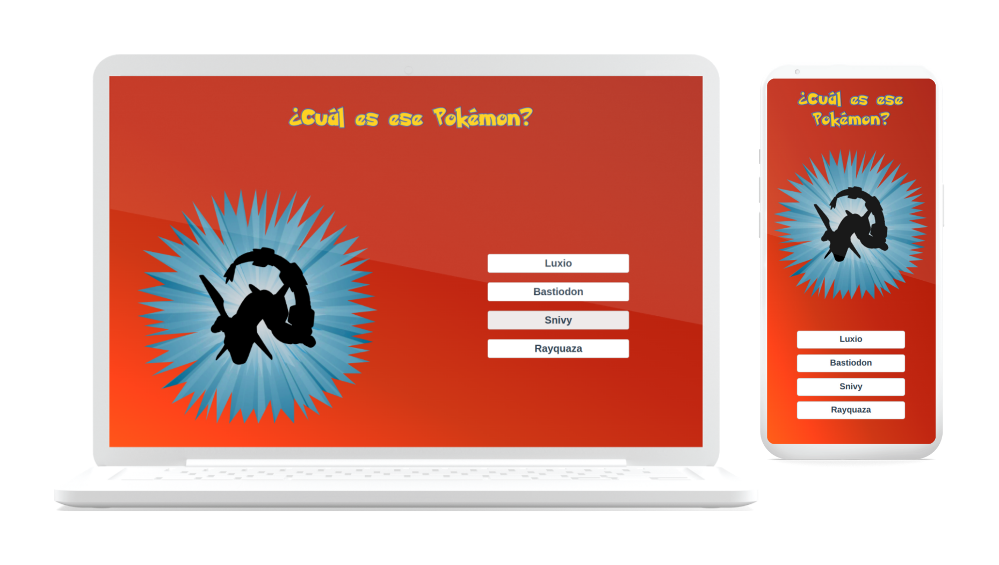

# vue-guess-pokemon-game
[](https://alexxispn.github.io/vue-guess-pokemon-game/)

## Project setup
```
npm install
```

### Compiles and hot-reloads for development
```
npm run serve
```

### Compiles and minifies for production
```
npm run build
```

### Run your unit tests
```
npm run test:unit
```

### Customize configuration
See [Configuration Reference](https://cli.vuejs.org/config/).

## Práctica realizada a partir del Curso de Vue de Fernando Herrera: 
[Curso de Vue](https://www.udemy.com/course/vuejs-fh/)
